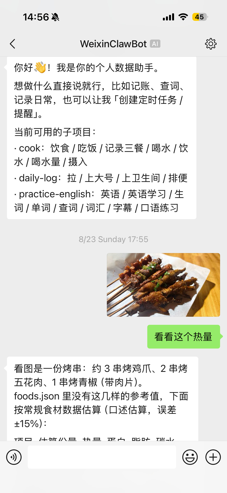
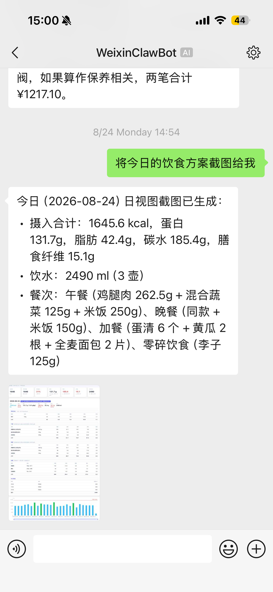
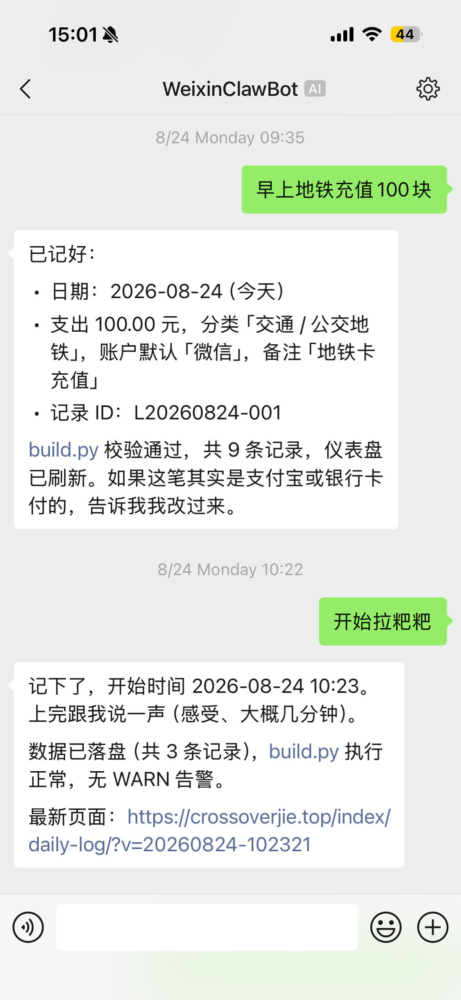
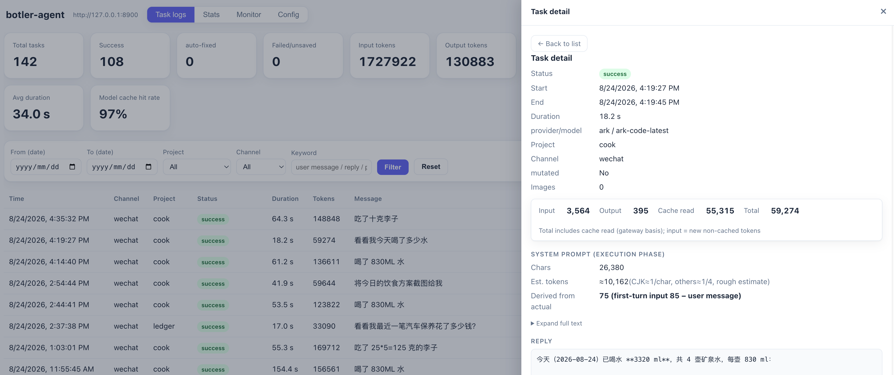

# botler-agent

<p align="center">
  
  
  
</p>

通用轻量个人 Agent 框架：从 **Telegram / 飞书 / 微信（iLink）** 接收消息，在**数据根目录（`DATA_ROOT`）**内的各数据子项目中自主完成短任务，并把结果回发给用户。可选运行定时任务（内置调度器），并提供本地 WebUI 与健康度监控。

- **框架只定义边界**：可操作目录白名单、只提供 `read / write / edit / run / schedule` 五个数据工具，外加 IM-only 的 `clear_conversation_context`（run 仅限项目内已有脚本，schedule 只写固定的外置 `schedules.json`，二者都不是任意 shell）、写后校验 JSON 合法、有改动自动 git commit。
- **业务规则由数据项目自描述**：每个数据子项目根目录的 `AGENTS.md` 描述其文件结构与操作规则，Agent 动手前先读它。框架不硬编码任何具体业务。
- **提示词与配置外置**：放在 `~/.botler-agent/`，跨 clone / 跨机器复用，用户可定制或让 AI 生成。

## 为什么选 botler-agent？

刻意做**轻**，区别于重型 Agent 框架：

- **轻量** — 只有六个工具，无重型运行时 / 守护进程，一个 `tsx` 进程即可，秒级安装。
- **省 token** — 每个任务都是全新短命 Agent，仅复用受限的最近可见对话窗口；路由只用「项目名 + 摘要」小提示词，只加载被选中子项目的约定。没有巨型 system prompt、不追长上下文，多数任务成本只有通用助手的零头。
- **聚焦垂直简单任务** — 不是通用聊天机器人，擅长小、重复、边界清晰的活（饮食记录、生词查询、定时提醒），每个由自己的 `AGENTS.md` 描述。

## botler-agent 与同类对比

| | **botler-agent** | **通用 Agent**（OpenClaw / WorkBuddy） | **Coding Agent**（Claude Code / Codex） |
|---|---|---|---|
| **定位** | 轻量个人数据助手 | 通用任务自动化 | 代码库内的软件工程 |
| **安装体积** | 单个 `tsx` 进程，秒级安装，无重型运行时 | 庞大的安装包，携带大量可能用不上的功能 | 较重，依赖完整的开发环境 |
| **内置工具** | 仅 6 个受控工具（read / write / edit / run / schedule + IM-only `clear_conversation_context`） | 内置大量、往往复杂的工具 | 完整的 shell、文件系统与命令权限 |
| **文件操作** | 路径白名单——仅限 `DATA_ROOT` 一级子目录 | 文件访问较开放 | 可读取/改写整个工作区 |
| **对电脑的权限** | 极其克制——无任意 shell | 较开放 | 高度开放（执行命令、修改代码） |
| **交互方式** | 移动端优先：微信 / Telegram / 飞书 聊天 | 多端 | 以桌面 / 终端为主 |
| **最擅长** | 轻量日常记录（饮食、生词、提醒） | 通用自动化 | 写代码、重构、调试 |

- **对比通用 Agent**：botler 更轻。没有臃肿的安装包堆砌冗余能力，没有大而全的工具集，文件访问也更克制、更安全。
- **对比 Coding Agent**：botler 刻意「做减法」。它面向手机端的轻量记录，而不是去操作你的电脑——因此对机器的权限要求极低，也不需要复杂的工具。

**自定义结构化数据**：botler-agent 不规定固定 schema。每个 `DATA_ROOT` 下的子项目自带 `AGENTS.md`（格式与约定）与数据文件，结构由你按自己的需求定义。如果想看具体的结构化数据布局范例（饮食/营养记录、日常记录、个人记账、旅行见闻），可参考开源模板集 [`botler-agent-app`](https://github.com/crossoverJie/botler-agent-app)。

## 安装

**方式 A — 从 GitHub clone（推荐）**

```bash
git clone https://github.com/crossoverJie/botler-agent.git
cd botler-agent
npm install
npm run init
```

**方式 B — curl 一行脚本**

```bash
curl -fsSL https://raw.githubusercontent.com/crossoverJie/botler-agent/main/install.sh | bash
```

clone 到 `~/.local/share/botler-agent`（可用 `BOTLER_INSTALL_DIR` 覆盖），自动执行 `npm install` + `npm run init`，且可重复执行——重跑时会 `git pull` 升级。

**方式 C — npm 全局 CLI**

```bash
npm i -g botler-agent
botler init     # 初始化 ~/.botler-agent/（.env + providers.json + system-prompt.md 模板）
botler -- "你的第一条消息"   # 或直接 `botler` 按 .env 启动常驻渠道
```

三种方式安装后配置相同：编辑 `~/.botler-agent/.env`（DATA_ROOT / 模型选择 / 渠道凭据），可选在 `~/.botler-agent/providers.json` 配置自定义网关，并按需定制 `~/.botler-agent/system-prompt.md`。

## 快速开始

```bash
npm install

# 1. 初始化用户级配置目录（~/.botler-agent/）
npm run init

# 2. 编辑 ~/.botler-agent/.env，填入 DATA_ROOT / 模型选择（PI_PROVIDER / PI_MODEL）/ 渠道凭据
# 3. 编辑 ~/.botler-agent/providers.json，配置你的模型供应商（baseUrl / apiKey / models）
# 4.（可选）定制 ~/.botler-agent/system-prompt.md（或让 AI 按项目背景生成）

# 5a. CLI 模式（本地调试，直接传一条消息）
npm start -- "早上吃了个馒头"

# 5b. 常驻渠道模式（按 .env 启动 Telegram / 飞书 / 微信）
npm start

# 6.（可选）微信 iLink 渠道——先扫码登录：
npm start -- wechat-login

# 7.（可选）通过 .env 开关启用调度器 / WebUI / 监控（SCHEDULER_ENABLED / WEBUI_ENABLED / MONITOR_ENABLED）
```

## 示例数据模板

本仓库在根目录以 git submodule 形式附带了一套开源的**数据模板集**：[`botler-agent-app`](https://github.com/crossoverJie/botler-agent-app)。它包含 4 个开箱即用的数据子项目的**格式与约定**（非真实数据）——`cook`（饮食/营养记录）、`daily-log`（日常记录）、`ledger`（个人记账）、`travel`（旅行见闻）。每个子项目都带有说明其 schema 的 `AGENTS.md` 以及合成的 `*.sample.json` 示例文件。

> 根目录下的 `botler-agent-app` submodule **仅用于展示/发现**：botler-agent 读取的是独立的 `DATA_ROOT`，并不读取框架仓库内的这个 submodule。要把模板真正用起来，需把 `botler-agent-app` 克隆进你自己的 `DATA_ROOT`。

带 submodule 一起克隆：

```bash
git clone --recurse-submodules <本仓库>
# 或者普通克隆后：
git submodule update --init --recursive
```

把它作为你的数据根目录使用（botler-agent 运行时会加载每个子项目的 `AGENTS.md`）：

```bash
export DATA_ROOT=/path/to/botler-agent-app   # 或只复制你需要的子项目文件夹到这里
npm start
```

各子项目的 schema 与定制说明见 [`botler-agent-app/README.md`](botler-agent-app/README.md)。

## 架构

```
Telegram / 飞书 / 微信（iLink）
      │  消息
      ▼
 channel adapter ──► Dispatcher（去重 + 顺序队列，串行化写操作）
                        │
                        ▼
                  Runner（两阶段：路由 → 执行）
                        ├─ ① 路由：判断消息属于哪个子项目（或 __scheduler__）；模糊则让用户说清楚
                        ├─ ② 执行：system prompt 按需拼接该子项目的 AGENTS.md
                        ├─ model（anthropic 或自定义 OpenAI-completions / anthropic-messages 网关）
                        └─ 工具 read / write / edit / run / schedule（白名单目录；run 仅限项目内脚本；schedule 只写 schedules.json；IM 执行额外加入 clear_conversation_context）
                        │
                        ▼
                  读/写 DATA_ROOT 下各子项目（每个子项目自带 AGENTS.md 描述约定）
                        │
                        ▼
                  Validator（校验所有数据 JSON 是合法 JSON，失败则自愈重试）
                        │
                        ▼
                  Git commit（遍历 DATA_ROOT 下各独立 git 仓库，有改动才提交）
                        │
                        └──► 最终文本回复（微信还会发送图片）

Scheduler ──► dispatch(schedule.message) ──►（同上流水线）
   └─ 若该条目带 recipient：deliver({text,images}, recipient) → 主渠道 → 兜底 telegram → feishu → wechat
```

### 模块职责

| 文件 | 职责 |
|------|------|
| `src/index.ts` | 入口：位置参数 → CLI / 微信 CLI 子命令；否则按 `.env` 启动渠道与服务 |
| `src/init.ts` | 初始化 `~/.botler-agent/`（.env + providers.json + system-prompt.md 模板）；已存在的文件不覆盖 |
| `src/config.ts` | 两级 `.env` 加载（用户级 > 源码级）+ providers.json + `CONFIG` + `USER_CONFIG_DIR` |
| `src/dispatcher.ts` | 去重 + 顺序队列 + 校验重试 + 提交编排（**绝不 reject**）+ 任务日志追加 |
| `src/runner.ts` | 两阶段路由 + new Agent + 收集最终回复 + 工具轮次上限 |
| `src/providers.ts` | 把自定义供应商配置构建成 pi-ai `Provider`（openai-completions / anthropic-messages） |
| `src/prompts/system-prompt.ts` | 内置通用默认提示词 + 路由提示词 + `loadSystemPrompt()`（按需加载，注入占位符） |
| `src/tools/paths.ts` | **安全边界**：`safePath()` 白名单校验 + `projectOf()` |
| `src/tools/{read,write,edit,run,schedule}.ts` | 五个 DATA_ROOT `AgentTool`；read/write/edit/run 经 `safePath` 校验（run 仅限项目内 python3/node 脚本）；`schedule` 管理 `schedules.json`（固定文件、无路径参数） |
| `src/tools/clear-conversation.ts` | IM-only 会话控制 `AgentTool`；通过 `task-context` 清空当前任务的会话，不触碰 `DATA_ROOT`，无路径参数 |
| `src/tools/task-context.ts` | 模块级每任务上下文；为 `schedule` 注入消息发送者，为 `clear_conversation_context` 注入当前会话 key |
| `src/safety/validate.ts` | 写后校验所有数据 JSON 合法（兜 edit 破坏语法），返回自包含的 `fix` 指令 |
| `src/safety/git.ts` | 遍历 DATA_ROOT 子项目各自 commit（可选 push） |
| `src/scheduler/{types,store,engine,cron}.ts` | schedules.json 的 schema + 校验/原子存储、进程内触发循环（watermark + `nextFireEpoch`），saved 监听器使写入立即唤醒循环 |
| `src/push/{types,contacts,deliver}.ts` | 推送类型；每渠道已知地址存储（`contacts.json`）；`deliver()` 主渠道发送 + `telegram → feishu → wechat` 兜底 |
| `src/logging/{types,collect,store}.ts` | 每任务 JSONL 日志（`task-logs/`），供 WebUI 使用 |
| `src/monitor/{stats,health}.ts` | 进程内计数器 + 本地健康/指标服务（`/healthz`、`/metrics`、`/healthz/history`） |
| `src/webui/server.ts` | 本地任务日志 WebUI（仅绑定 `127.0.0.1`） |
| `src/channels/allowlist.ts` | Telegram / 飞书共用的发送者白名单助手（微信有独立主号 + 额外发送者门控） |
| `src/channels/{telegram,feishu}.ts` | 渠道适配：grammy 长轮询 / 飞书 webhook（含解密） |
| `src/channels/wechat/*` | 微信 iLink 渠道：扫码登录（`login.ts`）、长轮询监听（`monitor.ts`）、媒体发送/上传、context_token 持久化（`context.ts`）、主号续期提醒循环（`reminder.ts`） |

## 配置目录 `~/.botler-agent/`

| 文件 | 作用 |
|------|------|
| `.env` | 用户级配置（`DATA_ROOT`、模型、渠道凭据、`GIT_PUSH`、`SCHEDULER_ENABLED`、`WEBUI_ENABLED`、`MONITOR_ENABLED` 等），权限 600 |
| `providers.json` | 自定义模型供应商（OpenAI-completions / Anthropic-messages 网关）：每个 provider 含 api / baseUrl / apiKey / models |
| `system-prompt.md` | 外置系统提示词，支持 `__DATA_ROOT__` / `__PROJECTS__` / `__PROJECT_CONTEXT__` / `__TODAY__` 占位符 |
| `schedules.json` | 定时任务配置（外置，与 providers.json 同机制）；由聊天、WebUI 或手改生成 |
| `contacts.json` | 每渠道已知地址存储（微信 context_token + 已记录地址），供推送使用 |
| `task-logs/` | 每日 JSONL 任务日志（供 WebUI 使用） |
| `wechat/account.json` | 微信 iLink 登录凭据（切勿提交） |

配置加载优先级（从高到低）：

```
进程环境变量  >  ~/.botler-agent/.env  >  源码 .env（开发回退）  >  内置默认值
```

可用 `BOTLER_CONFIG_DIR` 覆盖 `~/.botler-agent` 位置（测试 / 多套配置）。

### 自定义模型供应商（`providers.json`）

自定义 OpenAI-completions / Anthropic-messages 兼容网关（自建 / 内部端点，如自建 OpenAI-completions 网关、火山方舟 ark 编码端点）定义在 `~/.botler-agent/providers.json`（`npm run init` 会生成模板）。它是供应商元数据的主配置源；文件缺失时，旧版 `CUSTOM_BASE_URL` / `CUSTOM_API_KEY` 环境变量仍可作为兜底。

`api` 字段按供应商选择通信协议：`"openai-completions"`（默认）或 `"anthropic-messages"`。

```json
{
  "providers": {
    "custom": {
      "api": "openai-completions",
      "baseUrl": "https://your-gateway.example.com/v1",
      "apiKey": "sk-…",
      "models": [
        { "id": "your-model-pro", "name": "Your Model Pro", "reasoning": true, "contextWindow": 1048576, "maxTokens": 393216 },
        { "id": "your-model-flash", "name": "Your Model Flash", "reasoning": false, "contextWindow": 1048576, "maxTokens": 393216 }
      ]
    },
    "ark": {
      "api": "anthropic-messages",
      "baseUrl": "https://ark.cn-beijing.volces.com/api/coding",
      "apiKey": "sk-…",
      "models": [
        { "id": "ark-code-latest", "name": "…", "reasoning": false, "contextWindow": 524288, "maxTokens": 32768 }
      ]
    }
  }
}
```

- **选择模型**：在 `.env` 里把 `PI_PROVIDER` 设为某个 provider id、`PI_MODEL` 设为其中某个模型 id，然后重启——模型按进程缓存。
- **新增供应商 / 模型**：只需编辑本文件，无需改框架代码。格式有误的条目会被跳过并告警。
- **`api`**：`"openai-completions"`（OpenAI Chat Completions，默认）或 `"anthropic-messages"`（Anthropic Messages API，SDK 会在 baseUrl 后追加 `/v1/messages`）。
- **模型字段**：`id`（发给网关的模型 id）、`name`、`reasoning`（是否支持思考）、`contextWindow`（上下文 token 数）、`maxTokens`（最大输出 token 数）。
- **内置 anthropic**：设 `PI_PROVIDER=anthropic`，用 `ANTHROPIC_API_KEY` 或 `ANTHROPIC_AUTH_TOKEN` 鉴权即可（无需 providers.json 条目）。

### 自定义系统提示词

系统提示词外置后，你（或 AI 助手）可以按自己项目的背景定制：

1. `npm run init` 生成 `~/.botler-agent/system-prompt.md`（默认通用模板）。
2. 把模板替换成你自己数据子项目的约定（文件结构、操作规则等），保留 `__DATA_ROOT__` / `__PROJECTS__` / `__PROJECT_CONTEXT__` / `__TODAY__` 占位符。
3. 也可直接让 AI 助手生成，例如：

   > 我的 botler-agent 数据目录下有以下子项目：`notes/`（每日笔记）、`vocab/`（生词本）。
   > 请写一份 `~/.botler-agent/system-prompt.md`：说明每个子项目的数据文件结构与操作规则，
   > 遵循「先 read 再 write、保持 JSON 合法、字段类型一致、写后中文汇报」，并保留 `__DATA_ROOT__` / `__PROJECTS__` / `__PROJECT_CONTEXT__` / `__TODAY__` 占位符。

> **安全边界不因提示词改变**：白名单目录、无 bash 等由代码强制，提示词内容无法突破工具边界。

## 渠道

- **Telegram**（`grammy`，长轮询）：最简单，首选。需要 `TELEGRAM_BOT_TOKEN`；大陆网络下需配置 `TG_PROXY` 才能连接 API。可设置 `TELEGRAM_ALLOW_FROM`（逗号分隔的 Telegram 用户 id 或用户名）限制发送者；留空则全部放行。
- **飞书**（事件订阅 webhook，含解密）：需要 `FEISHU_APP_ID` / `FEISHU_APP_SECRET`；可选 `FEISHU_VERIFICATION_TOKEN` / `FEISHU_ENCRYPT_KEY`，监听 `FEISHU_PORT`（默认 3000）。可设置 `FEISHU_ALLOW_FROM`（逗号分隔的发送者 `open_id`/`user_id`/`union_id` 或 chat id）限制发送者；留空则全部放行。
- **微信（iLink / ClawBot 官方 Bot API）**：私聊渠道。先用 `npm start -- wechat-login` 登录（终端打印二维码，用微信扫码——凭据存入 `~/.botler-agent/wechat/account.json`），再设 `WECHAT_ENABLED=1` 启用。账号主号（扫码者）始终允许；`WECHAT_ALLOW_FROM` 可额外放行 `ilink_user_id`。续期提醒（`WECHAT_REMINDER_HOURS`）会在主号 24h `context_token` 窗口临近过期前提醒其刷新。
  - **入站图片即视觉输入**：微信可接收你发来的图片，解码后作为视觉输入喂给模型，并把原图持久化到 `DATA_ROOT/<project>/photos/`。由于微信「选图即发、文字后到」，入站图片会在一个短暂窗口内暂存（`WECHAT_IMAGE_BATCH_SECONDS`，默认 60s；设 `0` 关闭），让随后补发的文字作为同一条任务的描述合并进入；窗口内的多张图片也会合并。若当前模型无法读图，代理会用中文回复，请你补一句文字说明。
  - **问候短路**：仅含问候（如 你好 / hi）的消息会跳过路由 LLM 调用，直接给出一份零开销的中文欢迎语，列出当前可用子项目。
  - **上下文重置**：当用户明确要求新任务或忽略/重置上文时，路由模型或执行 Agent 会清空共享的最近对话窗口。纯重置命令本身不写入历史。

只有微信渠道会发送图片；其他渠道仅发文本（回复中的图片 markdown 会被去除）。

## 调度器（`schedules.json`）

设 `SCHEDULER_ENABLED=1` 运行进程内调度器。每个条目触发时进入 `dispatch`（绕过去重），若设置了 `recipient` 还会把结果回推给用户。条目可由聊天（`schedule` 工具）、WebUI 或手改 `schedules.json` 创建——都是同一份存储，写入会立即唤醒触发循环。

Schema——`cron` / `interval` / `at` / `once` 四选一：

```json
{
  "schedules": [
    {
      "id": "morning-water",
      "enabled": true,
      "cron": "0 8 * * *",
      "timezone": "Asia/Shanghai",
      "message": "提醒我该喝水了",
      "project": "my-project",
      "recipient": { "source": "wechat", "userId": "wxid_xxx" },
      "retry": { "max": 1, "backoffMs": 60000 },
      "silentHours": { "from": "23:00", "to": "07:00" }
    },
    {
      "id": "workday-standup",
      "enabled": true,
      "cron": "0 9,18 * * *",
      "timezone": "Asia/Shanghai",
      "message": "提醒我复盘今天的工作",
      "holidayMode": "workday",
      "recipient": { "source": "wechat", "userId": "wxid_xxx" }
    }
  ]
}
```

- `cron`：5 字段表达式（`分 时 日 月 周`）。
- `interval`：简单 `"5m"` / `"2h"` / `"1d"`（按分钟粒度、对齐墙钟）。
- `at`：每日固定 `"HH:MM"`（按 `timezone` 本地时间）。
- `once`：一次性绝对时间，ISO 8601 格式（如 `"2026-08-20T22:00:00+08:00"` 或 `"2026-08-20T14:00:00Z"`）。在那一瞬间**只触发一次**，之后永久失效。`silentHours` 对此类**有意不生效**——一次性提醒是用户指定的精确时刻。
- `timezone`：IANA 时区；默认 `Asia/Shanghai`。
- `message`：触发时发回给 Agent 的指令（走正常路由/执行）。
- `project`：可选路由提示；有效的子项目名可跳过路由 LLM 调用。
- `recipient`：可选；设置后触发结果通过 `deliver()` 推送——先主渠道，再按 `telegram → feishu → wechat` 兜底（仅在已配置且有已记录联系地址的渠道上）。微信推送会去掉 markdown，且是唯一同时发送图片的渠道。
- `retry` / `silentHours`：可选失败重试与免打扰窗口（落在窗口内的触发延后到窗口结束）。
- `holidayMode: "workday"`：**中国法定工作日门控**，仅作用于 `cron` / `interval` / `at` 触发。该条目**只在法定工作日触发**——跳过法定假日（法定假日），并在调休补班日（补班）正常触发。cron 的日期字段被忽略，只使用「时刻」（`hour:minute`），因此 `0 9,18 * * *` 会在每个工作日的 09:00 与 18:00 各触发一次。不可与 `once` 组合。日历在启动 + 每 24h 从 `BOTLER_HOLIDAY_API_URL` 拉取并缓存到 `BOTLER_HOLIDAYS_FILE`；任何拉取失败都保留缓存数据，并退化为普通周一至周五。

**路由**：创建/管理定时任务的消息（或含中文关键词 定时 / 提醒 / 日程）会路由到虚拟项目 `__scheduler__`；`schedule` 工具属于 `dataTools`，因此在任何执行上下文中都可用。非调度项目的 IM 执行任务还会额外获得 `clear_conversation_context`。

## WebUI

设 `WEBUI_ENABLED=1` 启动本地任务日志 WebUI（仅绑定 `127.0.0.1`，端口 `WEBUI_PORT`，默认 8900）。它读取 `task-logs/` 下每日 JSONL 日志，含监控视图（数据与 `/metrics` 一致）。唯一的写操作是删除任务日志。

<p align="center">
  
</p>

## 监控

默认启动一个本地健康/指标服务，监听 `127.0.0.1:MONITOR_PORT`（默认 8899，避开 3000=飞书 / 8900=webui），暴露 `/healthz`（JSON）、`/metrics`（Prometheus 文本）、`/healthz/history`（趋势采样）。设 `MONITOR_ENABLED=0` 只关闭独立 scrape 端口；WebUI 监控视图由 WebUI 进程自身采样，不受影响。

## 安全边界

- **应用与数据分离**：框架（本仓库，含 `.env`）与数据目录（`DATA_ROOT`）是两个独立位置。数据目录里只有被操作的项目，不含源码或密钥。
- **路径白名单**：`safePath()` 只放行 `DATA_ROOT` 下的一级子目录；用 `root + sep` 前缀匹配防止 `/agent2` 误入，并对最深已存在祖先做 `realpath` 防止符号链接逃逸。
- **不提供任意 shell**：只读/写/edit + 受控 run（仅限白名单项目内已存在的 python3/node 脚本，不经 shell、参数直传、超时 60s）+ 受控 schedule（只写固定的 `schedules.json`、无文件路径参数）。IM 执行额外只在当前会话暴露 `clear_conversation_context`，且不触碰 `DATA_ROOT`。git 提交由胶水层用 `execFileSync` 完成。

## 目录结构

```
src/
├── index.ts                 # 入口：CLI / 微信 CLI 子命令 / 按 .env 启动渠道与服务
├── init.ts                  # 初始化 ~/.botler-agent/（.env + providers.json + system-prompt.md 模板）
├── config.ts                # 两级 .env 加载 + providers.json + CONFIG（DATA_ROOT / 模型 / 渠道 / 调度器 / WebUI / 监控）
├── dispatcher.ts            # 去重 + 顺序队列 + 校验重试 + 提交编排（绝不 reject）
├── runner.ts                # 两阶段路由 + new Agent + 收集最终回复 + 工具轮次上限
├── providers.ts             # 构建自定义 OpenAI-completions / anthropic-messages 供应商
├── prompts/system-prompt.ts # 内置默认提示词 + 路由提示词 + loadSystemPrompt()（按需加载）
├── tools/
│   ├── index.ts             # 注册 read/write/edit/run/schedule + clear_conversation_context
│   ├── paths.ts             # safePath 白名单校验 + projectOf
│   ├── read.ts / write.ts / edit.ts / run.ts / schedule.ts
│   └── clear-conversation.ts # IM-only 会话上下文清理
│   └── task-context.ts      # 每任务上下文（把消息发送者注入为推送对象）
├── safety/
│   ├── validate.ts          # 写后校验所有数据 JSON 合法（兜 edit 破坏语法）
│   └── git.ts               # 遍历 DATA_ROOT 子项目各自 commit（可选 push）
├── scheduler/
│   ├── types.ts / store.ts / engine.ts / cron.ts   # schedules.json 的 schema、原子存储、进程内触发循环
├── push/
│   ├── types.ts / contacts.ts / deliver.ts         # 推送类型、每渠道已知地址存储、带兜底的推送
├── logging/
│   ├── types.ts / collect.ts / store.ts            # 供 WebUI 使用的每任务 JSONL 日志
├── monitor/
│   ├── stats.ts / health.ts                        # 进程内计数器 + 本地健康/指标服务
├── webui/
│   └── server.ts            # 本地任务日志 WebUI（仅绑定 127.0.0.1）
└── channels/
    ├── telegram.ts          # grammy + 长轮询
    ├── feishu.ts            # 飞书事件订阅 webhook（含解密）
    └── wechat/              # 微信 iLink：登录 / 长轮询监听 / 媒体 / context_token / 续期提醒
```

## 环境变量

| 变量 | 说明 |
|------|------|
| `DATA_ROOT` | 被 Agent 操作的数据根目录（白名单 = 其一级子目录） |
| `BOTLER_CONFIG_DIR` | 覆盖用户级配置目录（默认 `~/.botler-agent`） |
| `PI_PROVIDER` | pi-ai provider id（`anthropic` 或 `providers.json` 里定义的 provider id） |
| `PI_MODEL` | 模型 id（如 `claude-sonnet-4-5` 或 `your-model-flash`） |
| `ANTHROPIC_API_KEY` / `ANTHROPIC_AUTH_TOKEN` | 内置 anthropic 鉴权（当 `PI_PROVIDER=anthropic`） |
| `~/.botler-agent/providers.json` | 自定义 OpenAI-completions / Anthropic-messages 网关（每个 provider 含 baseUrl / apiKey / models）；旧版兜底：`CUSTOM_BASE_URL` / `CUSTOM_API_KEY` 环境变量 |
| `TELEGRAM_BOT_TOKEN` | Telegram BotFather token；留空则不启动 Telegram |
| `TG_PROXY` | 大陆网络下 Telegram API 需要代理（如 `http://127.0.0.1:7890`） |
| `TELEGRAM_ALLOW_FROM` | 可选逗号分隔的 Telegram 发送者白名单（用户 id 或用户名）；留空则全部放行 |
| `FEISHU_APP_ID` / `FEISHU_APP_SECRET` | 飞书应用凭据；留空则不启动飞书 |
| `FEISHU_VERIFICATION_TOKEN` | 飞书事件订阅 URL 校验 token（可选） |
| `FEISHU_ENCRYPT_KEY` | 飞书消息加密 key；不填则只处理明文事件 |
| `FEISHU_PORT` | 飞书 webhook 监听端口，默认 `3000` |
| `FEISHU_ALLOW_FROM` | 可选逗号分隔的飞书发送者白名单（`open_id`/`user_id`/`union_id` 或 chat id）；留空则全部放行 |
| `WECHAT_ENABLED` | `=1` 启动微信 iLink 渠道（需先完成 `wechat-login`） |
| `WECHAT_ALLOW_FROM` | 可选逗号分隔的额外 `ilink_user_id` 白名单（主号始终允许） |
| `WECHAT_REMINDER_HOURS` | 微信续期提醒阈值：`0`=关闭，`1`-`24`=主号静默 N 小时后提醒（默认 23） |
| `WECHAT_IMAGE_BATCH_SECONDS` | 微信入站图片批处理窗口（秒）：`0`=关闭批处理（立即分发），正整数则短暂暂存图片，让随后补发的文字合并为同一条任务（默认 60） |
| `GIT_PUSH` | `=1` 时提交后额外 git push（默认关，push 失败仅告警） |
| `WEBUI_ENABLED` | `=1` 启动本地任务日志 WebUI（仅绑定 127.0.0.1） |
| `WEBUI_PORT` | WebUI 监听端口，默认 `8900` |
| `BOTLER_LOG_DIR` | 任务日志 JSONL 目录（默认 `~/.botler-agent/task-logs/`） |
| `MONITOR_ENABLED` | `!=0` 启用本地健康/指标服务（默认开；`=0` 仅关闭独立端口） |
| `MONITOR_PORT` | 健康/指标服务端口，默认 `8899`（避开 3000 / 8900） |
| `SCHEDULER_ENABLED` | `=1` 运行进程内调度器，触发 `schedules.json` 条目 |
| `BOTLER_SCHEDULES_FILE` | 调度配置文件（默认 `~/.botler-agent/schedules.json`） |
| `BOTLER_HOLIDAY_API_URL` | `holidayMode:"workday"` 用的中国法定节假日日历源；`{year}` 占位符会被替换（默认 `https://raw.githubusercontent.com/NateScarlet/holiday-cn/master/{year}.json`） |
| `BOTLER_HOLIDAYS_FILE` | 缓存的节假日日历文件（默认 `~/.botler-agent/holidays.json`） |
| `MAX_TOOL_TURNS` | 单任务最大工具轮次（默认 20；临近上限时提示收尾，达到上限强制停止） |
| `CONVERSATION_CONTEXT_ENABLED` | `=0` 关闭最近对话上下文注入（默认开启） |
| `CONVERSATION_CONTEXT_TURNS` | 每个 IM 会话保留的最近可见轮数（默认 5；`0` 关闭注入） |
| `CONVERSATION_TURN_MAX_CHARS` | 每条存储的用户/助手消息最大字符数（默认 4000） |
| `CONVERSATION_CONTEXT_MAX_CHARS` | 注入上下文的全窗口字符上限；超限时从最旧轮开始丢弃（默认 12000） |

## 工作原理

### 一次任务的生命周期

1. 渠道收到消息 → `dispatch(text, { id, source, recipient })`。
2. **去重**：同一 `id`（如 `chatId:messageId`）在 5 分钟窗口内重复出现会被忽略。
3. **顺序队列**：所有任务串行执行，避免并发改坏同一文件。
4. `runTask` 两阶段：先路由判断消息属于哪个子项目（或 `__scheduler__`；无法确定则回复让用户说清楚），再新建独立 Agent、按需拼接该子项目的 `AGENTS.md` 约定，执行任务。`MAX_TOOL_TURNS` 上限约束执行：临近上限时提示模型收尾，达到上限则强制停止并给出诊断信息。
5. 只读任务直接返回；写任务先 `validateState()`（所有数据 JSON 是否合法）：
   - 通过 → `commitIfChanged()` 遍历提交被改动的子项目，追加任务日志，返回结果。
   - 不通过 → 用**自包含修正指令**再跑一次新 Agent 原地修复（不新增记录）；仍失败则返回错误提示且不提交。
6. 每次任务都会追加一条 JSONL 任务日志（`task-logs/`），供 WebUI/监控使用，无论成败。

### 调度与推送

- `SCHEDULER_ENABLED=1` 启动触发循环；到期条目以 `source: "scheduler"`、id 形如 `schedule:<id>:<epoch>` 进入 dispatch（绕过去重）。
- 若条目带 `recipient`，结果通过 `deliver()` 推送：先主渠道，再按 `telegram → feishu → wechat` 兜底（仅在已配置且有已记录联系地址的渠道上）。

### 数据文件约定

框架不硬编码任何数据 schema。每个数据子项目根目录的 `AGENTS.md`（或 `CLAUDE.md`，或 `CODEBUDDY.md`——取最先找到者）是权威约定，路由确定子项目后按需拼进 system prompt。`write` 工具保证序列化合法 JSON；`validate.ts` 只兜 `edit` 破坏 JSON 语法的情况。

## 脚本

| 命令 | 说明 |
|------|------|
| `npm start` | 运行（CLI 或常驻渠道，取决于参数与 .env） |
| `npm run dev` | 同 `npm start` |
| `npm run init` | 初始化 `~/.botler-agent/` |
| `npm run typecheck` | `tsc --noEmit` 类型检查 |
| `npm run cli` | 同 `npm start` |
| `npm test` | `node:test` 测试套件（调度 cron + 存储） |

## 许可证

[AGPL-3.0](LICENSE)（GNU Affero General Public License v3）。第三方依赖的许可证声明见 [`THIRD-PARTY-LICENSES`](THIRD-PARTY-LICENSES)。

> **AGPL 提示**：若你将**修改过**的 botler-agent 作为网络服务运行（如公开的机器人），必须向与之交互的用户提供其源代码。

## 相关文档

- 给 AI 编码助手的仓库说明：[`AGENTS.md`](AGENTS.md)
- 环境变量模板：[`.env.example`](.env.example)
